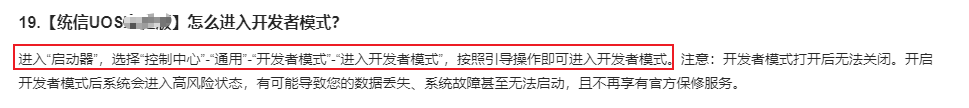
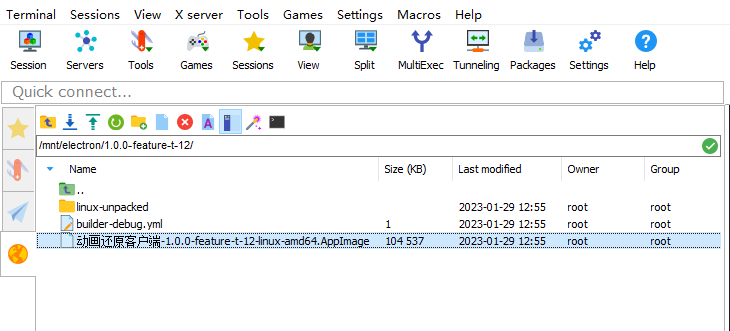
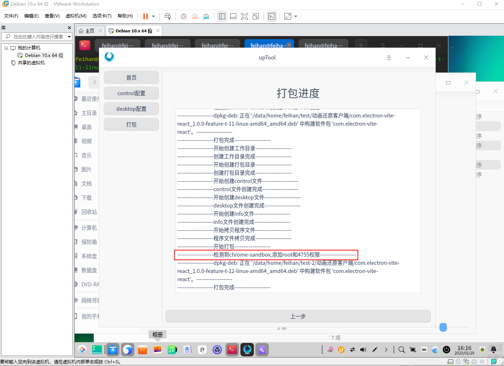
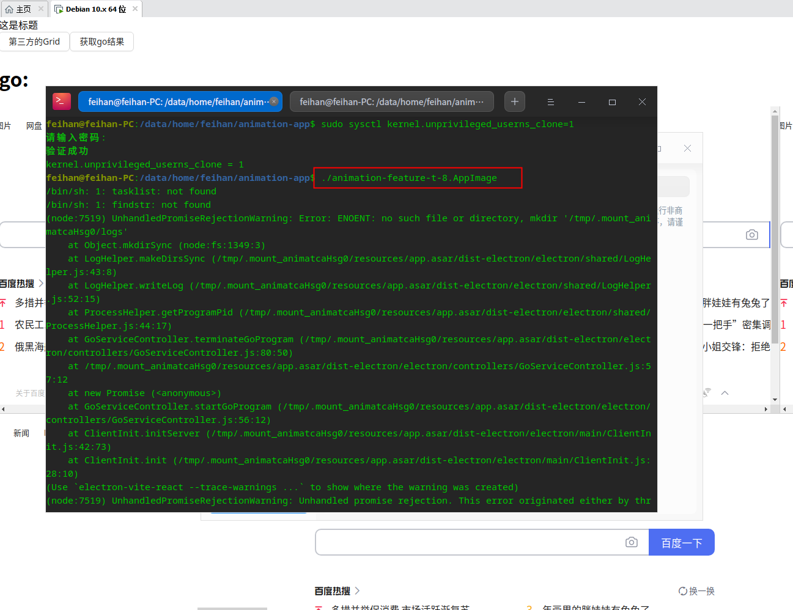
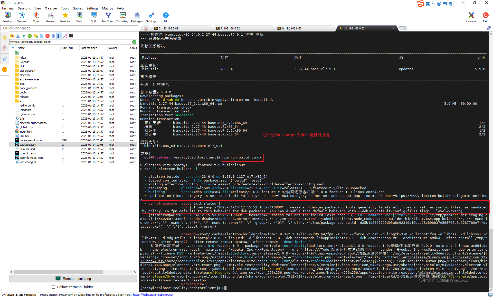

## 国产UOS系统中验证动画还原客户端是否可正常安装运行

背景：安装VMware，下载UOS专业版，在VMware中创建国产UOS系统虚拟机

### 如何打包动画还原客户端的linux安装包

解决方式：在运行gitlab runner 的CI机器上做linux的打包，方式有两种：1. 写CI脚本，正常提交代码后可运行；2. 直接将项目拷贝到CI的机器上，安装依赖验证；

目前使用的是第二个方案，可快速验证。CI的linux机器可以直接翻墙，IP为`192.168.8.62`, 打开MobaXitem可以找到该机器

### 如何将动画还原客户端的linux安装包拷贝到虚拟机中的操作系统中，如UOS系统、麒麟系统中

解决方式：将打包后的动画还原客户端的linux安装包拷贝到Nas的这个目录`Z:\客户端\动画还原`，启动相应的虚拟机，
打开浏览器，输入`192.168.8.160:5000`或者`nas.reality3d.can:5000`，登录nas找到上面存放的目录，下载下来。

### linux安装electron

1. 优先使用`npm i --unsafe -perm`
2. 若electron安装报错，则使用该目录安装electron`sudo npm install electron -g --unsafe-perm`

### 查看打包后的asar包命令

`asar list ./release/[版本号]/win-unpacked/resources/app.asar`

### 遇到的问题

1. 执行动画还原客户端的`.AppImage`文件时，UOS报“未通过系统安全检测”

**解决方案**

启动开发者模式，具体设置见下图：


2. error while loading shared libraries: libffmpeg.so: cannot open shared object file: No such file or directory

**解决方案**
`sudo apt-get --reinstall install ffmpeg`

**参考链接**：

+ [askubuntu.com/questions](https://askubuntu.com/questions/704003/chromium-will-not-start-libffmpeg-problem)

3. Solve “The SUID sandbox helper binary was found, but is not configured correctly.” (3 solutions!)

**解决方案**

推荐使用
`sysctl kernel.unprivileged_userns_clone=1`

**参考链接**：

+ [authmane512.medium](https://authmane512.medium.com/solve-the-suid-sandbox-helper-binary-was-found-but-is-not-configured-correctly-3-solutions-4f1425a9a76c)
+ [electron github issues](https://github.com/electron/electron/issues/17972)

### 打包linux安装包，并验证是否可用。目前支持的linux安装包格式有：amd x64、amd x64
验证方式：安装动画还原客户端后，验证go程序是否可正常运行；验证方式：点击页面中`获取go结果`按钮

补充说明：appimage文件是linux下的安装包，deb是UOS系统下的安装包，在UOS系统下，直接安装运行是无反应的，需要转换成deb软件包，并发给UOS系统的客户安装即可。

#### linux amd x64的安装包打包流程： 
1. 运行CI打包流程，在git runner虚拟机中获取到打包后的文件，文件存放目录如截图所示：

##### 将`.Appimage`格式转换为`.deb`格式

1. 将第1步的文件拷贝到UOS操作系统中；
2. UOS操作系统中安装[upTool](https://gitee.com/uos-package/upTool) ，运行以下命令安装：
  
```shell
  sudo apt install devscripts build-essential git gcc qt5-default libdtkwidget-dev
  mkdir uptool & cd uptool
  git clone https://gitee.com/uos-package/upTool.git
  cd upTool
  debuild -b
  ```

3. 转换为`.deb`格式，按照如下步骤操作：
   1. 新建目录test，将`.Appimage`文件放到该目录下；
   2. 解压`.Appimage`文件，打开终端在test目录下依次执行`chmod +x com.xx-1.0.2.Appimage`，`chmod +x com.xx-1.0.2.Appimage --appimage-extract`会生成一个新的文件夹叫squashfs-root
   3. 参考链接：[关于UOS系统下打包安装使用的问题总结](https://developer.aliyun.com/article/1139938)
   4. 打开upTool工具，填写配置，注意：
      工作目录：就是test；
      主程序：选择squashfs-root目录下的Apprun；
      目录：选择squashfs-root；
      然后就是打包静等片刻后，test文件夹会出现一个新的文件夹，打开后里面的deb文件就是打包后的安装包。
      到此，appimage打包成deb安装包成功。

#### 可能会遇到的问题：
1. upTool转deb格式时，如截图所示，且安装后go启动失败。

**解决思路**：解包-加权限-打包

1. 格式：`dpkg-deb -R [要解压的deb文件名] [解压后存放目录]`
   exp：`dpkg-deb -R xxx.deb test-1`；
2. 经过第一步，你会生成一个文件夹，找到files文件夹内，一般路径是第一步生成文件夹下的：`opt/apps/com.[应用名称]/files`；
3. 终端进入第1步中的解压后存放目录，执行如下命令，格式：`sudo chown root:root opt/apps/com.[应用名称]/files/chrome-sandbox`,`sudo chown 4755 opt/apps/com.[应用名称]/files/chrome-sandbox`；
4. 打包，格式：`dpkg-deb -b [解压后存放目录]/ [打包后存放目录]`
   exp：`dpkg-deb -b test-1/ .`
5. 参考链接: [UOS系统下安装软件打不开的解决方法](https://blog.csdn.net/wanghaoyingand/article/details/126494114?spm=a2c6h.12873639.article-detail.129.63662d4f50aDaI)


#### linux amd x64的安装包转为deb格式

### 遗留问题

1. 动画还原客户端的`.AppImage`文件在UOS上跑起来了，但是该后缀格式的文件仅仅是运行，并不会安装到到电脑上。所以需要验证下怎么打包.deb格式的文件，安装到UOS中运行。
   截图中的报错信息是没有走安装流程，导致应用的日志文件新建失败；

   

2. 直接使用`electron-builder` 打包deb，报截图所示错误：

   

4. 安装包的打包（多个平台的）、管理，两种方式；
   1. 本地打包`windows`、CI打包`linux`，手动归档这两个平台的安装包到nas，并区分测试版本、正式版本；
   2. 寻找 `electorn` 跨平台交叉编译打包的方式
   3. [在Win10下交叉编译Electron项目](https://jasonkayzk.github.io/2020/11/08/%E5%9C%A8Win10%E4%B8%8B%E4%BA%A4%E5%8F%89%E7%BC%96%E8%AF%91Electron%E9%A1%B9%E7%9B%AE/)
5. `IpcConst.ts`为 electron 中事件订阅的状态，`src`目录在对接IPC时需要用到，需要做到共享。目前直接使用绝对路径引入时，前端`src`目录报错，所以暂时是各自维护一份；
6. 配置eslint规则，参考`azsw-basic-platform`；
7. 客户端打包icon图标的设置；
9. 插件模块化的设计、方案研究；

**参考链接**

+ [如何在 Linux 中使用 AppImage](https://www.cnblogs.com/pipci/p/16109756.html)
+ [uos打包——appimage包转uos的deb包](https://blog.csdn.net/qq_43657810/article/details/117396070)
+ [Electron在Linux下打包](https://blog.csdn.net/wanghaoyingand/article/details/126703125)
