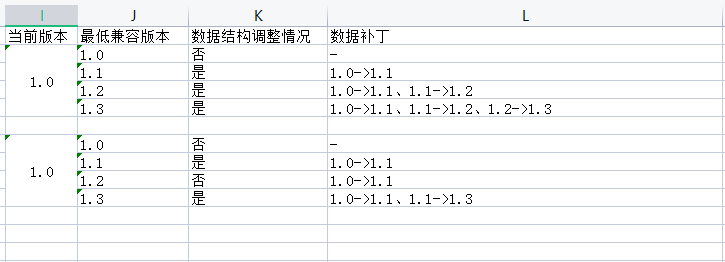

## 数据管理、升级版本、版本管理制定流程和策略；
1. 数据升级是go程序处理，electron调用go的接口去升级；
2. 升级数据版本事项：
   + 若数据结构存在差异，需要通过升级补丁的方式订正数据;
   + 数据校验、订正流程在客户端初始化时处理；
   + 应用数据补丁流程：
3. 升级流程：
    1. 检测动画还原客户端当前数据版本；
    2. 获取数据升级清单；
    3. 安装升级规则，依次使用补丁升级数据版本；
4. 升级注意事项：
    1. 确认补丁升级失败的处理流程；升级后的数据要可以正常使用；
